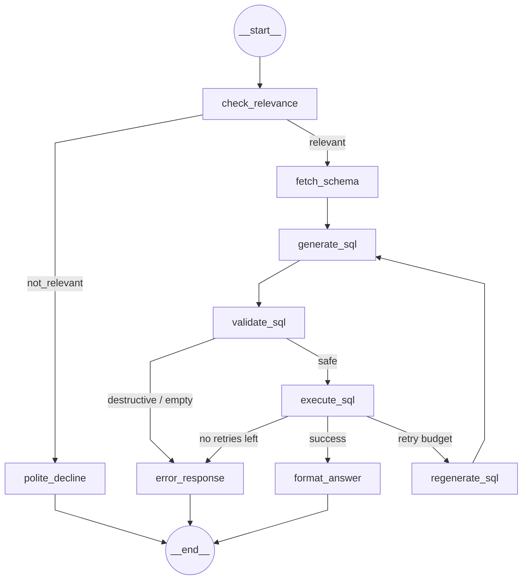

# University Database QA Agent

A natural language question-answering system over a university database, built with LangGraph. Ask questions in plain English and get accurate answers powered by SQL and an LLM.

## Architecture

The agent is a 9-node LangGraph pipeline that converts natural language questions into SQL, executes them, and formats the results. It includes a retry cycle for failed queries and graceful handling of off-topic questions.



See [`docs/graph.png`](docs/graph.png) for the rendered diagram.

## Quick Start

```bash
# 1. Clone and set up
git clone https://github.com/gilosr/GenpactHW.git
cd GenpactHW
python -m venv .venv && source .venv/bin/activate
pip install -r requirements.txt

# 2. Configure
cp .env.example .env
# Edit .env: add OPENAI_API_KEY (or ANTHROPIC_API_KEY) and LANGSMITH_API_KEY

# 3. Seed the database
python -m db.seed

# 4. Run a query
python -c "
from agent.conversation_manager import ConversationManager
from agent.cache import QueryCache
cm = ConversationManager(cache=QueryCache())
session = cm.create_session()
result = cm.ask('How many students are there?', session)
print(result['answer'])
"
```

## Running Tests

```bash
# All unit tests (fast, no API keys needed) — 257 tests
pytest --ignore=tests/evals

# Include LLM eval tests (requires API keys)
pytest
```

## Demo Script

Run 20 questions through the agent (relevant + off-topic) to see the full pipeline in action:

```bash
python run_questions.py
```

## Project Structure

```
GenpactHW/
├── db/                         Database layer (no LLM code)
│   ├── schema.sql              SQLite DDL — 4 tables (teachers, students, courses, enrollments)
│   ├── connection.py           SQLAlchemy engine factory + FK enforcement
│   ├── seed.py                 Deterministic seed: 6 teachers, 20 students, 12 courses, 52 enrollments
│   └── database.py             DatabaseManager — agent's only DB interface
├── agent/                      LangGraph pipeline
│   ├── state.py                AgentState TypedDict (InputState / OutputState)
│   ├── nodes.py                9 node functions + 3 routing functions
│   ├── graph.py                StateGraph assembly, compiled app with MemorySaver
│   ├── llm.py                  LLM provider factory (OpenAI / Anthropic auto-detect)
│   ├── cache.py                LRU query cache with TTL
│   └── conversation_manager.py Multi-turn session management
├── prompts/                    Prompt templates (no execution logic)
│   ├── manager.py              PromptManager — builds all message lists
│   ├── schemas.py              Pydantic structured output models
│   ├── hub.py                  LangSmith Hub integration (optional)
│   └── domains/
│       ├── base.py             Abstract domain interface
│       └── university.py       University-specific prompt templates
├── api/
│   └── main.py                 FastAPI endpoint (/api/ask, /health)
├── web/                        Browser UI
│   ├── index.html
│   ├── app.js
│   └── styles.css
├── tracing/
│   └── tracer.py               print_trace(), get_trace_summary(), LangSmith config check
├── tests/                      pytest suites (257 tests, all run offline)
│   ├── conftest.py             Shared fixtures (in-memory DB, mock LLMs)
│   ├── test_database.py        DB layer — schema, FK, seed counts
│   ├── test_sql_generation.py  SQL generation pipeline
│   ├── test_agent_e2e.py       End-to-end graph tests
│   ├── test_nodes.py           Node function unit tests
│   ├── test_cache.py           LRU cache tests
│   ├── test_conversation_manager.py  Session + follow-up tests
│   ├── test_prompt_manager.py  Prompt builder tests
│   ├── test_state_and_prompts.py     State schema tests
│   ├── test_tracing.py         Tracing utilities
│   ├── test_tracing_ui_api.py  API + tracing integration
│   ├── test_config.py          Config validation
│   └── evals/                  LLM evaluation tests (require API keys)
│       ├── eval_sql_generation.py
│       └── eval_relevance.py
├── docs/
│   ├── examples.md             13 example queries with SQL, results, and traces
│   ├── design.md               Architecture and design decisions
│   ├── production.md           Production upgrade path
│   ├── golden_dataset.md       Evaluation dataset
│   └── graph.png               Rendered agent graph diagram
├── config.py                   Pydantic-settings config (LLM temps, retries, cache TTL)
├── run_questions.py            Demo script — 20 questions through the agent
├── requirements.txt
└── .env.example
```

## Example Queries

| Complexity | Question | Pattern |
|---|---|---|
| Simple | "How many students are there?" | COUNT |
| Medium | "How many students per course?" | JOIN + GROUP BY |
| Hard | "Average grade per teacher?" | 3-table JOIN + AVG + status filter |
| Very Hard | "Top student per department?" | CTE + RANK() OVER |

See [docs/examples.md](docs/examples.md) for full examples with SQL, results, and execution traces.

## Design Decisions

See [docs/design.md](docs/design.md) for:
- LangGraph pipeline architecture and node design
- DB-agnostic design (swap SQLite → PostgreSQL by changing one env var)
- Error handling and retry strategy
- Memory and caching architecture
- Tracing approach (LangSmith + `steps` audit trail)

## Production Considerations

See [docs/production.md](docs/production.md) for reliability, scalability, security, deployment, and cost management.
