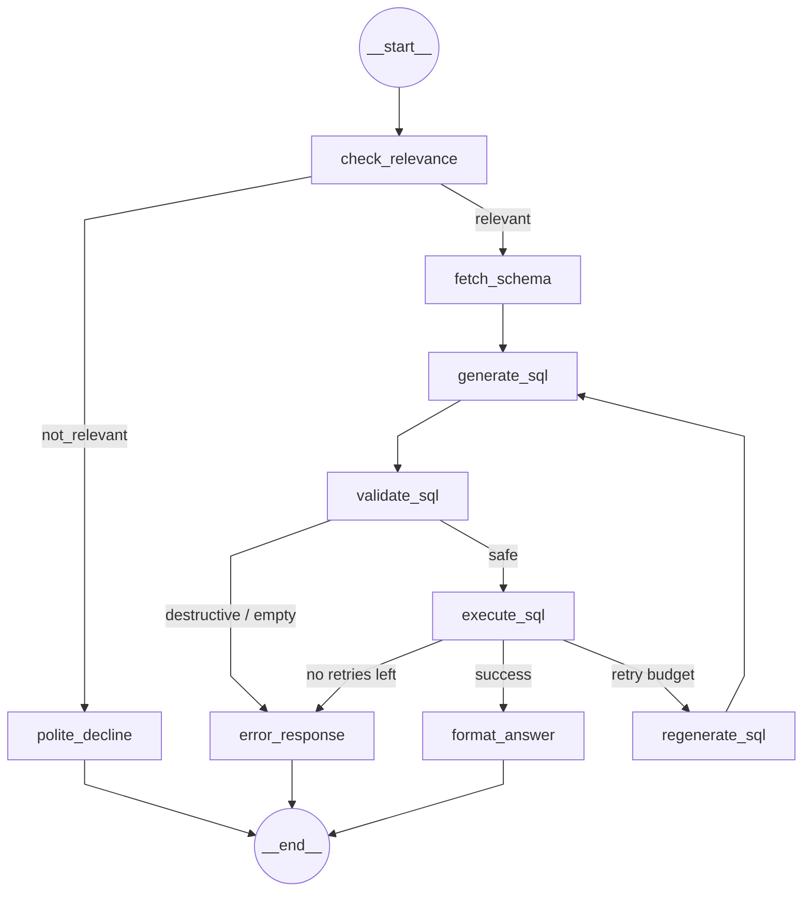

# University Database QA Agent

A natural language question-answering system over a university database, built with LangGraph. Ask questions in plain English and get accurate answers powered by SQL and an LLM.

## Architecture

The agent is a 9-node LangGraph pipeline that converts natural language questions into SQL, executes them, and formats the results. It includes a retry cycle for failed queries and graceful handling of off-topic questions.



See [`docs/graph.png`](docs/graph.png) for the rendered diagram.

## Quick Start

```bash
# 1. Clone and set up
git clone <repo-url>
cd Genpact
python -m venv .venv && source .venv/bin/activate
pip install -r requirements.txt

# 2. Configure
cp .env.example .env
# Edit .env: add OPENAI_API_KEY (or ANTHROPIC_API_KEY) and LANGSMITH_API_KEY

# 3. Seed the database
python -m db.seed

# 4. Run a query
python -c "
from agent.conversation_manager import ConversationManager
from agent.cache import QueryCache
cm = ConversationManager(cache=QueryCache())
session = cm.create_session()
result = cm.ask('How many students are there?', session)
print(result['answer'])
"
```

## Running Tests

```bash
# All unit tests (fast, no API keys needed)
pytest

# Include integration tests (requires API keys)
pytest -m integration
```

## Project Structure

```
Genpact/
├── db/                     Database layer (schema, seed, access)
│   ├── schema.sql          SQLite DDL — 4 tables
│   ├── connection.py       SQLAlchemy engine factory
│   ├── seed.py             Deterministic seed data
│   └── database.py         DatabaseManager — agent's only DB interface
├── agent/                  LangGraph agent
│   ├── state.py            AgentState TypedDict
│   ├── nodes.py            9 node functions + 3 routing functions
│   ├── graph.py            StateGraph assembly, compiled app
│   ├── llm.py              LLM provider config (OpenAI/Anthropic)
│   ├── cache.py            LRU query cache with TTL
│   └── conversation_manager.py  Multi-turn session management
├── prompts/
│   └── templates.py        All LLM prompt templates
├── tracing/
│   └── tracer.py           LangSmith config + trace utilities
├── tests/                  pytest suites
│   ├── test_database.py    DB layer tests
│   ├── test_sql_generation.py  SQL generation pipeline tests
│   ├── test_agent_e2e.py   End-to-end graph tests
│   ├── test_nodes.py       Node function unit tests
│   ├── test_cache.py       Cache unit tests
│   ├── test_conversation_manager.py  Session tests
│   └── test_tracing.py     Tracing utility tests
├── docs/
│   ├── examples.md         13 example queries with SQL, results, traces
│   ├── design.md           Architecture and design decisions
│   ├── production.md       Production upgrade path
│   └── graph.png           Rendered agent graph diagram
├── requirements.txt
├── .env.example
└── BUILDING_BLOCKS.md      Implementation plan and status
```

## Example Queries

| Complexity | Question | Pattern |
|-----------|----------|---------|
| Simple | "How many students are there?" | COUNT |
| Medium | "How many students per course?" | JOIN + GROUP BY |
| Hard | "Average grade per teacher?" | 3-table JOIN + AVG |
| Very Hard | "Top student per department?" | CTE + RANK() OVER |

See [docs/examples.md](docs/examples.md) for full examples with SQL, results, and traces.

## Design Decisions

See [docs/design.md](docs/design.md) for:
- LangGraph pipeline architecture
- DB-agnostic design (swap SQLite → PostgreSQL by changing one env var)
- Error handling and retry strategy
- Memory and caching architecture
- Tracing approach (LangSmith + state audit trail)

## Production Considerations

See [docs/production.md](docs/production.md) for reliability, scalability, security, deployment, and cost management.
