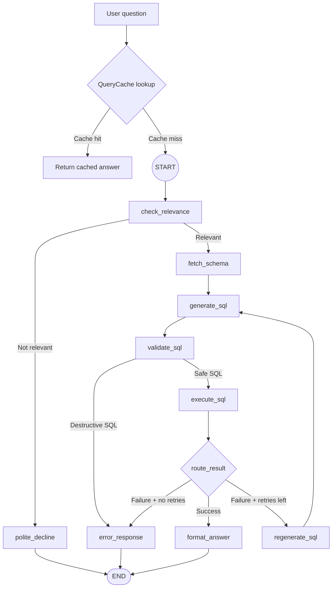

# University Database QA Agent

A natural language question-answering system over a university database, built with LangGraph. Ask questions in plain English and get accurate answers powered by SQL and an LLM.

## Architecture

The agent is a 9-node LangGraph pipeline that converts natural language questions into SQL, executes them, and formats the results. It includes a retry cycle for failed queries and graceful handling of off-topic questions.

Request flow with cache before the LangGraph pipeline:



## Quick Start

```bash
# 1. Clone and set up
git clone https://github.com/gilosr/GenpactHW.git
cd GenpactHW
python -m venv .venv && source .venv/bin/activate
pip install -r requirements.txt

# 2. Configure
cp .env.example .env
# Edit .env: add OPENAI_API_KEY (or ANTHROPIC_API_KEY) and LANGSMITH_API_KEY
# Restart the server after changing .env values.

# 3. Seed the database
python -m db.seed

# 4. Run a query
python -c "
from agent.conversation_manager import ConversationManager
from agent.cache import QueryCache
cm = ConversationManager(cache=QueryCache())
session = cm.create_session()
result = cm.ask('How many students are there?', session)
print(result['answer'])
"
```

## Web UI and API

Start the trace UI (requires seeded DB + API keys in `.env`):

```bash
uvicorn api.main:app --reload --port 8765
# Open http://localhost:8765
```

Three UI tabs:

- **Dashboard** — live Q&A with step-by-step trace timeline
- **Evaluation** — CSV upload, column mapping, LLM-as-judge runs
- **Trace History** — browse/search persisted past runs

Once the server is running, navigate to `http://localhost:8765/docs` to view the interactive API documentation (Swagger UI).

### Evaluation in the Web UI

Run regression checks against the golden dataset directly via the Evaluation tab:

1. Upload [docs/golden_dataset.csv](docs/golden_dataset.csv)
2. Map the input column and expected-output columns — SQL columns use execution accuracy; NL columns use the LLM judge
3. Each row is evaluated via `ConversationManager` + `EvaluationEngine` ([evaluation/evaluator.py](evaluation/evaluator.py))
4. Scoring combines a 5-level LLM judge rubric with deterministic SQL result comparison ([evaluation/execution_accuracy.py](evaluation/execution_accuracy.py))
5. Results are persisted to `evaluation_runs/` (gitignored)

Optional config overrides in [config.py](config.py): `EVAL__JUDGE_MODEL`, `EVAL__RESULTS_DIR`.

## Running Tests

```bash
# All unit tests (fast, no API keys needed)
pytest --ignore=tests/evals

# Include LLM eval tests (requires API keys)
pytest
```

## Demo Script

Run the golden dataset questions through the agent (relevant + off-topic) to see the full pipeline in action:

```bash
python run_questions.py
```

## Project Structure

```
GenpactHW/
├── agent/                      LangGraph pipeline and session management
├── api/                        FastAPI app and routes
├── db/                         Database layer and schema
├── docs/                       Golden evaluation dataset
├── evaluation/                 LLM-as-judge and execution accuracy pipelines
├── prompts/                    Prompt templates and management
├── scripts/                    Utility scripts
├── tests/                      Pytest suites
├── tracing/                    Tracing utilities and LangSmith integration
├── web/                        Browser UI and dashboards
├── config.py                   Pydantic-settings configuration
├── run_questions.py            Demo script for running test queries
├── requirements.txt
└── .env.example
```

## Example Queries

| Complexity | Question | Pattern |
|---|---|---|
| Simple | "How many students are there?" | COUNT |
| Medium | "How many students per course?" | JOIN + GROUP BY |
| Hard | "Average grade per teacher?" | 3-table JOIN + AVG + status filter |
| Very Hard | "Top student per department?" | CTE + RANK() OVER |

## Design Decisions

- **LangGraph pipeline** — 9 nodes with conditional routing, retry cycle (max 3 attempts), and graceful off-topic handling
- **DB-agnostic design** — swap SQLite → PostgreSQL by changing `DATABASE_URL`; agent never imports `db/connection.py` directly
- **Error handling** — destructive SQL blocked before execution; empty results and DB errors trigger retry or controlled error response
- **Memory and caching** — `ConversationManager` injects sliding-window history for follow-ups; `QueryCache` serves exact-match standalone questions (LRU + TTL)
- **Prompt management** — domain templates via `PromptManager` with optional LangSmith Hub pull and local fallback
- **Tracing** — LangSmith integration plus `steps` audit trail in agent state; trace history persisted to `db/history.db`
- **Evaluation** — LLM-as-judge rubric plus execution accuracy for golden dataset regression
